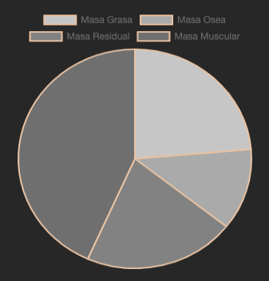

Este es un proyecto [Next.js](https://nextjs.org/) iniciando con [`create-next-app`](https://github.com/vercel/next.js/tree/canary/packages/create-next-app).

## Comenzando

Primero, ejecutar el servidor de desarrollo:

```sh
npm run dev
```

Abra [http://localhost:3000](http://localhost:3000) con su navegador para ver el resultado de manera local.

## Practica 01

Esta práctica consiste en un dashboard el cual tiene botones con acceso al inicio, Acerca de y un formulario el cual regresa la composicion corporal del usuario

### Ventanas Desplegables

- Ventana: `Home`
  En esta ventana se muestra los datos principales al correr el programa, el cual se encuentra en modo "**beta**", ya que aun no cuenta con informacion relevante.

  

- Ventana: `About`
  En esta ventana se despliega informacion acerca de mi, con botones con acceso a mis redes y una foto de mi persona.

  

- Ventana: `Corporal`
  Esta ventana muestra un formulario el cual le pide una serie de datos al usuario que al ser llenados devuelve una tabla la cual le indica al usuario su composicion corporal junto con una gráfica de los porcentajes de grasa corporal.

  

### Componentes

- Componente: `Form`
  Dicho componente despliega un formulario con opciones de tipo "**number**", los cuales se usaran para calcular la composicion corporal del usuario.


- Componente: `Menu`
  El componente menu es el encargado de redireccionar las distintas ventanas que el usuario puede navegar.

  

- Componente: `TableResults`
  Este componente muestra de manera visual en una tabla los resultados obtenidos al calcularse los distintos tipos de mediciones del usuario.

  

- Componente: `Charts`
  Este componente se encarga de mostrar de manera visual al usuario una grafica de tipo "**pie**" el cual ayudara a mostrar de otra forma los resultados.

  

## Aprende Mas

Para obtener más información sobre Next.js y otros componentes, puede consultar los siguientes recursos:

- [Next.js Documentation](https://nextjs.org/docs) - Obtenga más información sobre las funciones y la API de Next.js.
- [Learn Next.js](https://nextjs.org/learn) - Un tutorial interactivo de Next.js.

- [Learn Chart.js](https://www.chartjs.org/docs/latest/) - Introduccion basica a graficos con Chart.js

- [Create Your Colors](https://paletadecolores.online/) - Crea tu paleta de colores y has tu pagina mas creativa.

## Meta

Juan Diaz – [@tparadyse](https://www.instagram.com/tparadyse) – al19760726@ite.edu.mx

Distribuido bajo la licencia XYZ. Consulte `LICENCE` para obtener más información.

[https://github.com/tparadyse/github-link](https://github.com/dbader/)
